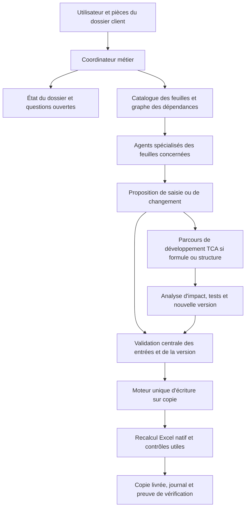

# Plan de conception — agents BP réutilisables TCA Conseil

**Statut : proposition du 11 septembre 2026. L’outil décrit ici n’est pas encore construit.**

Ce projet est distinct de la remise du dossier ISP. Il vise un socle réutilisable pour d’autres clients, construit à partir de l’architecture modulaire du BP existant. Ce document ne crée ni agent, ni classeur vierge, ni nouvelle version du moteur. Aucun fichier client n’a été modifié pour le rédiger.

## 1. Résultat recherché

Créer une trame de BP exploitable pour plusieurs clients, puis une famille de **33 agents spécialisés, un par feuille**, capables d’en expliquer les entrées, les calculs, les sorties et les dépendances. L’utilisateur doit pouvoir remplir un BP par questions métier, comprendre un résultat et demander une évolution contrôlée du modèle.

Le socle conserve les feuilles, les chaînes de calcul et les composants Excel utiles. Les données propres au dossier d’origine sont retirées d’une **copie de travail** : prix, volumes, contrats, effectifs, coûts particuliers, investissements, financements, hypothèses de marché et pièces justificatives. Les paramètres réellement génériques sont conservés seulement après qualification. Conserver une formule ne signifie pas que son comportement à vide est déjà correct.

Deux parcours restent distincts :

| Parcours | Demande typique | Pouvoir de l’agent | Condition de sortie |
|---|---|---|---|
| Saisie courante | « Ajouter un contrat, un recrutement ou un investissement documenté » | Proposer puis appliquer des valeurs dans les entrées autorisées d’une copie ; remplacer seulement les défauts calculés explicitement prévus | Plan de saisie validé, nouvelle copie, journal, état de reprise et statut de recalcul |
| Évolution du modèle | « Ajouter une offre, modifier une règle de reconnaissance ou réparer une formule » | Analyser et proposer un changement ; l’écriture passe par le parcours de développement TCA | Analyse d’impact, modification versionnée, tests indépendants, recalcul natif et nouvelle carte de compatibilité |

La saisie courante ne peut pas se transformer silencieusement en réparation de formule. Le second parcours doit être explicitement demandé ; il ne s’active pas parce qu’une pièce jointe le réclame ou qu’un contrôle refuse un fichier.

## 2. Architecture proposée



Les 33 agents sont d’abord **33 contrats de responsabilité et 33 guides de raisonnement**. Il n’est pas nécessaire d’exécuter 33 conversations en parallèle à chaque demande. Le coordinateur sollicite les agents concernés par le graphe, regroupe leurs questions et contrôle les conflits. Une seule transaction écrit dans un classeur à la fois.

Le moteur central conserve les propriétés utiles du moteur de saisie existant : liste des entrées autorisées, identification de version, comparaison de l’état attendu des cellules, refus des formules libres en saisie, journal et préservation de la source. Son adaptation aux autres clients fait partie du projet ; le manifeste spécifique au dossier d’origine ne doit pas être réutilisé tel quel.

Le service de calcul natif est séparé. Un agent sans accès à Excel peut produire une copie saisie avec un statut « recalcul requis », mais ne doit pas annoncer de nouveaux résultats à partir des anciens caches. Les tables de sensibilité et une éventuelle résolution WACC par macro ont des preuves d’exécution propres.

## 3. Ce que signifie « trame vierge »

Un inventaire classe chaque cellule avant tout effacement. La couleur seule ne décide ni de sa nature ni du droit d’écriture.

| Classe | Traitement de la future trame | Exemples / précautions |
|---|---|---|
| Donnée propre au client | Retirer de la copie générique, puis demander au nouveau client | Prix, objectifs de volume, contrats, noms de salariés, salaires, coûts unitaires, actifs réels, opérations de financement |
| Hypothèse métier dépendant du client | Laisser indéfinie ou inactive tant qu’elle n’est pas confirmée | DSO, DPO, couverture de stock, charges, marges, inflation, taux de dette, fiscalité applicable, primes et comparables |
| Paramètre technique | Conserver et documenter, avec contrôle de cohérence | Capacité de calendrier, unités de stockage, modes disponibles, règles de répartition et identifiants stables |
| Défaut calculé modifiable | Conserver la formule ; documenter ses dépendances et l’exception de remplacement | Durée ou nature proposées par le catalogue CAPEX, paramètres liés à un scénario |
| Calcul / sortie | Conserver la formule ; adapter son diagnostic à l’absence de données si nécessaire | CA, COGS, BFR, cash, bilan, DCF, graphiques |
| Élément documentaire propre au dossier source | Retirer ou remplacer dans la nouvelle version générique | Noms de clients, commentaires, sources privées, objectifs de négociation, titres et texte libre |

**Vide et zéro restent différents.** Un prix manquant n’est pas un prix nul ; un salaire inconnu n’est pas un salarié gratuit. À l’inverse, un module déclaré inactif peut produire des flux nuls sans erreur. Les états doivent distinguer au minimum : `NON_RENSEIGNE`, `HYPOTHESE`, `CONFIRME`, `INACTIF`, `A_RECALCULER` et `VERIFIE_SUR_PERIMETRE`.

Une valeur fiscale favorable ne doit pas continuer à s’appliquer silencieusement au seul motif que le champ est « à confirmer ». Le futur socle doit afficher les hypothèses actives et rendre indisponible un résultat nécessitant une qualification absente. Aucun taux de TVA, dispositif R&D ou taux d’IS ne devient universel par héritage du premier dossier.

Les libellés utilisés comme clés dans `INDEX/EQUIV`, les noms définis et les codes de catégories ne se vident pas comme du texte décoratif. Prévoir des identifiants techniques génériques stables — par exemple `OFFRE_01` — séparés des libellés affichés. Cette séparation est une évolution de modèle à tester ; elle ne doit pas être simulée par un simple remplacement global des noms.

Le calendrier doit également devenir un contrat explicite : date de départ, durée active et capacité technique. Rechercher les années codées en dur. Un changement d’année de départ avec des actifs ou dettes antérieurs exige un traitement des soldes d’ouverture ; il ne suffit pas de déplacer les en-têtes.

## 4. Les 33 agents de feuille

La liste ci-dessous reprend les **33 noms de feuilles observés** dans la source. Les responsabilités proposées doivent être confirmées par l’extraction complète des formules et des dépendances avant implémentation. « Entrées » désigne le sujet métier, pas une autorisation d’écrire toute la feuille.

| N° | Feuille / agent | Entrées à comprendre | Calculs et sorties à expliquer ou vérifier | Droit en saisie courante |
|---|---|---|---|---|
| 01 | Légende | Conventions de couleurs, unités, protection | Lisibilité de la carte des saisies | Lecture ; proposition documentaire à TCA |
| 02 | Previsionnel | Synthèses et paramètres réellement identifiés lors de la cartographie | Vue d’ensemble du BP et liens vers ses sources | Lecture ; aucune entrée supposée par le seul nom de la feuille |
| 03 | Control | Horizon actif, ouvertures et paramètres de pilotage autorisés | Calendriers, cohérence des bornes, diagnostics d’ouverture | Entrées expressément cartographiées |
| 04 | Assumptions | Offres, prix, volumes, capacités et hypothèses globales | Cohérence des unités, données manquantes, effets des paramètres communs | Entrées ; catalogues structurels dans un profil distinct |
| 05 | DATA Contrats | Contrats identifiés, quantités, prix, dates, facturation, TVA | Complétude d’un contrat et calendrier documenté | Registre autorisé ; pas d’objectif commercial déguisé en contrat |
| 06 | Contrats | Registre et objectifs commerciaux | Demande, capacité, reports FIFO et conservation du prix par cohorte | Lecture des résultats et diagnostic amont |
| 07 | Revenue | Livraison, facture et encaissement issus des contrats | CA reconnu/facturé/encaissé, créances, avances, FAE/PCA | Lecture ; aucune correction directe d’un résultat |
| 08 | DATA COGS | Méthode de coût, coût unitaire, marge, composantes variables | Assiettes et absence de coûts négatifs involontaires | Hypothèses de coût autorisées |
| 09 | COGS | Activité et paramètres de coût | Coûts de production et rapprochement à l’activité | Lecture et diagnostic |
| 10 | Stock | Couverture, délais fournisseurs, stock initial | Achats, consommation, stock final, dettes et règlements | Paramètres autorisés ; pas de solde inventé |
| 11 | Charges_Externes | Charges récurrentes, variables et contrats de service | Assiettes, saisonnalité, indexation, entretien/assurance des baux | Paramètres identifiés seulement |
| 12 | Effectifs | Fonctions, dates réelles, ETP, salaire de référence, charges | ETP mensuels, masse salariale et affectation R&D | Registre RH autorisé |
| 13 | BFR | Conditions clients/fournisseurs, stocks et TVA provenant des sources | BFR comptable, variation et norme de régime permanent | Lecture ; norme calculée non écrasable |
| 14 | DATA CAPEX | Actif, nature, montant, date, R&D, Cash/bail, services inclus | Complétude, valeurs proposées par défaut, dates d’exploitation | Registre et seuls défauts modifiables documentés |
| 15 | CAPEX | Registre des actifs | Décaissements, amortissements, VNC et loyers | Lecture ; réparation via parcours TCA |
| 16 | Financement Dette | Montant, taux, durée, différé, tirage, remboursement | Capital, intérêts, échéances et dette restante | Registre de dette autorisé |
| 17 | DATA Financement | Equity, comptes courants et aides d’exploitation datés | Catégories, montants et traçabilité des opérations | Registre autorisé |
| 18 | Financement E&S | Registre et décalages de scénarios | Agrégats de financement, calendrier et apport de référence | Décalages explicitement autorisés ; agrégats protégés |
| 19 | SUBVENTION_INVEST | Base, taux, tranches, dates et durée de reprise | Encaissements et reprise comptable, sans double application du taux | Registre autorisé |
| 20 | CALCUL_CIR | Dépenses et qualifications documentées, aides et remboursements | Assiette R&D retenue et rapprochement des contributions | Champs de qualification et dépenses autorisés |
| 21 | ATELIER_CIR_IS | Paramètres fiscaux, régime/taux TVA et échéances | IS, CIR, taxes et TVA : charges, créances, paiements | Hypothèses autorisées ; aucune éligibilité inventée |
| 22 | Modèle financier | Flux de tous les modules | Consolidation mensuelle, charges, cash et financement | Lecture et diagnostic des chaînes |
| 23 | Compte de Résultat | Agrégats du moteur | CA, marge, EBE, résultat et impôts | Lecture ; pas de résultat saisi en remplacement |
| 24 | Bilan | Soldes d’ouverture sourcés et mouvements du modèle | Actifs, passifs, résultat, dette et équilibre | Point d’entrée d’ouverture uniquement s’il est désigné comme source unique |
| 25 | Flux de trésorerie | Résultat et variations bilancielles | Flux opérationnels, investissements, financement et cash | Lecture et rapprochement |
| 26 | Plan de financement | Besoins et ressources | Déficits, besoins de financement et cohérence temporelle | Lecture ; aucun financement ajouté pour forcer l’équilibre |
| 27 | KPI Dashboard | Date d’événement étudiée et sorties métier | Indicateurs, runway avec/sans financements futurs, alertes | Paramètres de consultation autorisés seulement |
| 28 | Contrôles | Résultats et cohérences transversales | Diagnostic, criticité, preuve et agents à solliciter | Lecture ; jamais effacer une alerte par modification du contrôle |
| 29 | Sensi TCA | Presets et scénarios manuels | Effets de chocs, suppression/décalage des apports | Leviers autorisés ; méthode de composition protégée |
| 30 | Sensi Analyses | Chocs et axes des scénarios | Tables natives et comparaison au calcul scalaire | Leviers autorisés ; caches des tables non saisissables |
| 31 | Sensi Graphiques | Résultats des sensibilités | Séries, unités, sens des effets et libellés | Lecture ; changements de graphiques par parcours TCA |
| 32 | Valorisation | Méthodes, sources WACC, sortie, croissance et paramètres autorisés | DCF/VC, BFR terminal, dette nette, WACC et fraîcheur macro | Hypothèses documentées ; pas de calibration cachée |
| 33 | Comparables | Sociétés, transactions, statistiques, bêtas, scores, sources | Pondérations, désendettement/réendettement et couverture des données | Entrées du panel ; calculs et colonnes de validité protégés |

Pour chaque feuille, produire un dossier homogène : rôle, liste des entrées, unités et bornes, blancs/zéros, formules de défaut, calculs clés, sorties, dépendances entrantes/sortantes, contrôles, questions métier et cas de test. Les fonctions propres au premier client doivent être recensées avant d’être déclarées génériques.

## 5. Contrats de données et orchestration

Le dossier client ne dépend pas de la mémoire d’une conversation. Il contient un identifiant de client, un identifiant de dossier, la version du modèle, la dernière copie reconnue, son empreinte, les journaux, les réponses sourcées et les questions ouvertes. Ne pas identifier un dossier par « le fichier le plus récent ».

Le catalogue central décrit chaque champ par un identifiant stable, sa feuille/adresse, son type, son unité, ses règles de complétude, ses choix, ses dépendances, sa politique de formule et son domaine de calendrier. Les bornes dynamiques sont calculées depuis les **entrées prospectives du lot**, pas depuis les caches précédents.

Chaque agent retourne une proposition structurée, jamais une formule libre à exécuter en saisie :

```json
{
  "client_id": "CLIENT_TEST_A",
  "model_version": "tca-bp-template/1",
  "request_id": "DEMANDE_001",
  "intent": "input_update",
  "field_id": "capex.acquisition_date",
  "source_evidence_id": "REPONSE_003",
  "affected_module": "DATA CAPEX",
  "open_questions": [],
  "status": "PROPOSITION_A_VALIDER_PAR_LE_MOTEUR"
}
```

Le moteur ajoute l’adresse effective de la ligne libre vérifiée, la valeur, l’état attendu et la raison, puis contrôle le lot entier. Un identifiant de demande et un journal permettent de détecter un doublon ; un rejeu ne doit pas créer deux contrats ou deux postes.

Le graphe inclut les dépendances cellule/plage, noms définis, entrées et rectangles des tables natives, macro WACC et liaisons entre sources et défauts. Il distingue les chaînes de calcul classiques de la résolution locale WACC ; il ne propose pas d’activer globalement le calcul circulaire d’Excel.

Si deux agents proposent des valeurs incompatibles, le coordinateur présente le conflit métier et suspend seulement ce lot. Si une transaction échoue, l’ancienne copie reste disponible et l’état précise les artefacts réellement créés. Si Excel est absent, la saisie peut aboutir avec un statut de recalcul incomplet ; les résultats financiers ne sont pas déclarés à jour.

## 6. Parcours de modification de formule ou de structure

Ce parcours reste dans l’environnement de développement TCA, séparé du pack de saisie remis aux clients.

1. Décrire le besoin et un exemple avant/après. Identifier les feuilles, champs, contrôles et sorties concernés.
2. Calculer le périmètre d’impact à partir du graphe. Signaler les constantes protégées, clés de catalogue, noms, macros, validations et tables touchés.
3. Créer une branche ou copie de développement liée à une version précise. Conserver le modèle de départ et ses preuves.
4. L’agent propriétaire de la feuille propose le changement ; les agents des feuilles dépendantes vérifient les conséquences. Le moteur de maintenance applique les modifications autorisées dans cette copie uniquement.
5. Tester avec des attentes calculées indépendamment, puis recalculer dans Excel. Comparer les zones hors impact ; chaque différence inattendue doit être expliquée ou corrigée.
6. Faire valider la version par le responsable TCA désigné. Régénérer la carte, les empreintes, la documentation et, si nécessaire, le plan de migration des dossiers existants.
7. Publier une nouvelle version identifiée, avec possibilité de revenir à la précédente. Ne pas remplacer silencieusement le modèle d’un dossier client en cours.

Une réparation de formule qui rend simplement un contrôle vert ne suffit pas : la règle économique attendue et les rapprochements indépendants doivent être démontrés.

## 7. Déroulement et critères d’acceptation

| Phase | Livrables concrets | Critères de passage |
|---|---|---|
| 0 — Figer le point de départ | Copie interne de référence identifiée ; inventaire des 33 feuilles et composants ; état des tests disponibles | Source inchangée ; aucune copie de secret ; distinction claire entre résultats historiques et vérifications effectuées |
| 1 — Cartographier | `catalogue_champs.json`, `graphe_dependances.json`, 33 fiches de feuille, matrice des hypothèses propres au client | Chaque entrée a une source et une politique ; aucune plage entière autorisée par approximation ; défauts et sorties distingués |
| 2 — Construire la trame générique | Copie de développement sans données client, catalogue technique stable, règles de complétude, paramètres de calendrier | 33 feuilles conservées ; absence de données du client d’origine ; aucun CA ou salaire inventé ; états indéfinis explicites ; absence d’erreurs Excel non qualifiées |
| 3 — Adapter le moteur central | Générateur de carte interne, moteur de saisie générique, profils de droits, journal, reprise et contrôle de version | Écritures autorisées uniquement ; aucune modification imprévue de formule/composant ; refus d’un mauvais dossier, mauvais modèle et plan périmé |
| 4 — Activer les agents de saisie | Coordinateur et agents des principales feuilles d’entrée, puis agents de calcul/diagnostic | Demandes métier réalisées sur copie ; questions ciblées ; défauts correctement résolus sans cache ; tests de doublon et reprise réussis |
| 5 — Couvrir les 33 feuilles et la maintenance | Guides/agents complets, parcours de changement de formule, analyse d’impact et migration | Un changement contrôlé démontré de bout en bout ; zones hors impact préservées ; version antérieure toujours exploitable |
| 6 — Valider plusieurs dossiers fictifs | Campagnes sur trois dossiers isolés, rapports natifs, documentation de prise en main | Les tests locaux, natifs et de dialogue passent sur les fichiers distribués ; aucune donnée d’un dossier n’apparaît dans un autre |

Commencer la phase 4 par les entrées qui alimentent le plus de calculs : Control/Assumptions, DATA Contrats, DATA COGS, Effectifs, DATA CAPEX et financements. Les agents de BFR, fiscalité, bilan, cash et contrôles vérifient ensuite leurs effets. Les indicateurs, sensibilités et valorisations viennent après la fiabilité de ces chaînes.

La cadence sera fixée après la cartographie ; ce plan ne promet pas un délai ou un nombre de journées sans mesure du travail restant.

## 8. Recette indépendante proposée

Utiliser uniquement des **dossiers fictifs**, séparés de tout dossier client réel :

- **Dossier A — services :** pas de stock ni d’actifs nécessaires ; contrats, acomptes, reconnaissance et encaissements ; recrutement à date réelle. Vérifier l’inactivité des modules industriels sans zéros inventés dans les données manquantes.
- **Dossier B — fabrication :** capacité, report de commandes, achats/stock, règlement fournisseurs, actif Cash et crédit-bail. Vérifier les cohortes à prix signé, la fin des loyers et la reprise de coûts de services après leur couverture contractuelle.
- **Dossier C — investissement/R&D :** dette, aide d’investissement et aide d’exploitation, qualification fiscale explicitement renseignée, plusieurs scénarios. Vérifier les montants accordés, l’absence de double application d’un taux et les conditions d’activation de la valorisation.

Dans chaque dossier : test à activité nulle explicitement choisie, entrées partielles, activation progressive, bord de calendrier, changement de scénario, journal repris, sauvegarde Excel et changement de version refusé. Les objectifs commerciaux fictifs ne deviennent pas des valeurs de la trame distribuée.

Les oracles doivent contrôler notamment :

- Conservation demande/activité/report et facturation/encaissement/créances ; distinction prix unitaire et total.
- Stocks, fournisseurs et TVA reconstruits depuis les événements ; BFR terminal calculé depuis les conditions permanentes.
- Loyers, intérêts et amortissements sans double compte ; échéances de durée minimale et de fin de plan.
- Équilibre bilan et rapprochement des trois lectures du cash, au centime selon des tolérances documentées.
- Valeur de la table de sensibilité comparée à un scénario scalaire indépendant ; état des entrées restauré ensuite.
- WACC : données nécessaires, double compte des risques, convergence locale et détection d’une modification après calcul ; aucune calibration implicite.
- Refus de formule libre en saisie, données de pièce jointes traitées comme données, injection d’instructions ignorée, reprise avec mauvais journal et mélange de clients refusés.

Ne pas confondre « aucun message d’erreur Excel » avec « résultat économique exact ». Ne pas multiplier les tests qui recopient la formule ; privilégier des exemples dont l’attendu se déduit séparément de la règle métier.

## 9. Isolation des clients et conservation des éléments TCA

Prévoir trois espaces séparés : **socle TCA**, **dossiers clients**, **jeux de test fictifs**. Chaque dossier possède ses fichiers, permissions, journaux, sources et contexte. Aucun agent ne réutilise une réponse, une pièce, un prix, un mot de passe ou un extrait privé d’un autre client.

Avant création de la trame générique, rechercher les informations du dossier source dans les cellules visibles et masquées, commentaires, en-têtes/pieds de page, noms définis, liens externes, objets, graphiques, caches et propriétés. Le nettoyage est documenté et testé ; les clés qui participent aux calculs suivent une migration explicite.

Ne pas extraire ni réemployer d’identifiant de connexion, code à usage unique, mot de passe ou autre secret du dossier source. Les éventuels mots de passe de protection sont propres à chaque livraison et transmis par un canal séparé. La protection de feuille n’est pas du chiffrement ; l’accès aux documents client relève aussi de leur stockage et de leurs permissions.

Conserver chez TCA le générateur, les sources, les tests, les versions et le protocole de scellement. Distribuer au client uniquement le pack et les documents nécessaires à la version autorisée. Le droit de modification des formules ne doit pas être accordé au pack client par simple changement de prompt.

## 10. Première étape à lancer si ce plan est retenu

**Commencer par la cartographie et le contrat de trame vierge, avant de créer les 33 agents.** Cette première étape doit livrer les 33 fiches de feuille, le graphe, les champs à vider/conserver/transformer et les tests de référence. Elle permettra de mesurer les adaptations nécessaires pour retirer les données d’un client sans casser les calculs.

Les agents spécialisés seront ensuite construits sur cette connaissance commune. Leur rôle est de comprendre les feuilles et de proposer des actions cohérentes ; la fiabilité des fichiers repose sur les contrats de données, le moteur unique, les vérifications indépendantes et le versionnement.

**À ce stade : plan rédigé uniquement. Aucune trame générique, aucun agent et aucune migration de classeur n’ont été exécutés.**
