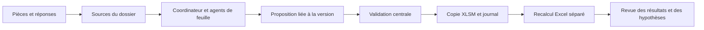

# Architecture TCA BP

## Parcours d'une demande

`service.Application` est le point d'entrée des trois interfaces : Tkinter, CLI et MCP. Il lie chaque opération à un dossier identifié. `storage.Store` maintient les sources, plans, révisions, qualifications et événements dans SQLite. Les chemins sont confinés à l'espace du dossier et les transactions utilisent un verrou exclusif entre processus.

`ModelEngine` vérifie la structure et les formules, prépare les états attendus puis écrit les entrées autorisées dans une nouvelle copie. La trame et sa carte sont produites par `model_build` depuis la référence locale autorisée. La sérialisation OOXML conserve les composants requis du XLSM et retire les résultats devenus périmés.

`Coordinator` expose 33 responsabilités. Les agents proposent ; le service écrit. L'état d'une conversation ne tient pas lieu de base de données. Les instructions présentes dans des pièces jointes restent du texte documentaire.

## Identité et transaction

Une proposition possède `case_id`, `client_id`, `model_id`, `revision`, `source_sha256`, `request_id` et des sources du même dossier. Un même identifiant de demande avec un contenu différent est refusé. Un rejeu d'une demande appliquée retourne son résultat existant.

La copie et ses reçus sont préparés sous `transactions/`. La nouvelle version est publiée exclusivement ; le pointeur de la version courante est ensuite mis à jour en transaction SQLite. En cas d'arrêt, les artefacts restent identifiables et l'ancienne référence demeure disponible. Un diagnostic de reprise énumère les transactions inachevées ; il n'adopte pas automatiquement un fichier par son nom ou sa date.

Les fichiers sources sont copiés avant extraction. Le texte extrait et son empreinte décrivent ainsi le même instantané. Une source altérée après import bloque les écritures qui s'y réfèrent.

## Recalcul et preuve

Le service natif ouvre la source en lecture seule avec événements et macros désactivés, sans mise à jour de liens. Il calcule puis sauvegarde une nouvelle copie. Les signatures d'entrées avant/après doivent être identiques et le modèle doit rester compatible. Le statut de calcul ne constitue pas une approbation économique.

Les limites de calendrier, qualifications fiscales, conditions des valeurs manquantes, tables de sensibilité et résolution WACC sont décrites séparément. Les règles de maintenance doivent être exécutées dans un espace de modèle distinct, avec une nouvelle version et des attentes de test indépendantes.

## Choix techniques

- Python 3.14, Tkinter, SQLite et manipulation ZIP/XML pour le moteur.
- `pypdf` pour extraire le texte des PDF. Pas d'OCR implicite.
- MCP stdio sans serveur réseau et sans clé API intégrée.
- Stockage local distinct du dépôt pour éviter le versionnement de données client.

Une utilisation simultanée par plusieurs collaborateurs sur un serveur demanderait un service de stockage et d'authentification dédié. Le verrou local et SQLite ciblent l'application de bureau ; ils ne constituent pas une architecture de collaboration distante.
